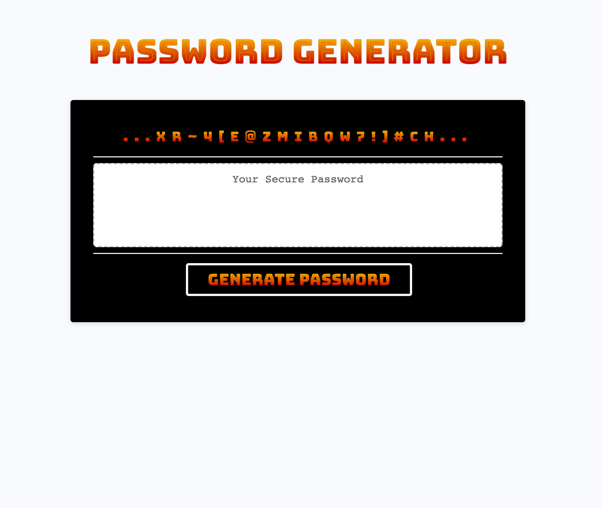

# Password Generator

## Description

The amount of personal and financial data stored behind a simple series of letters and numbers these days is staggering.  It can be challenging to continuously create and renew passwords without repeating old ones.  This password generator application is a simple and effective way to do just that.  It takes little to know thought and yet produces truly unique passwords for our most important information.  Keep this application bookmarked and the problem of creating a new password disappears!

Writing the JavaScript almost entirely from scratch for this project helped me to learn not only specific principles but the overarching flow of a JavaScript file.  The order of operations and the heirarchy of code lines is substantially more important than with CSS or even HTML.

## Installation

Installation is easy!  Simply copy and paste the following URL into your favorite browser:

https://argounova.github.io/password-generator/

## Usage

Click "Generate Password".  Follow the prompts to reveal your unique password.

## Credits

Google Fonts: https://fonts.google.com/specimen/Bungee+Spice/tester

## License

N/A - Open Source